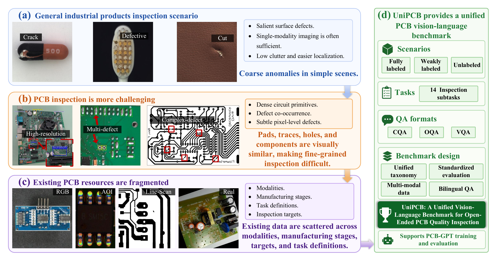
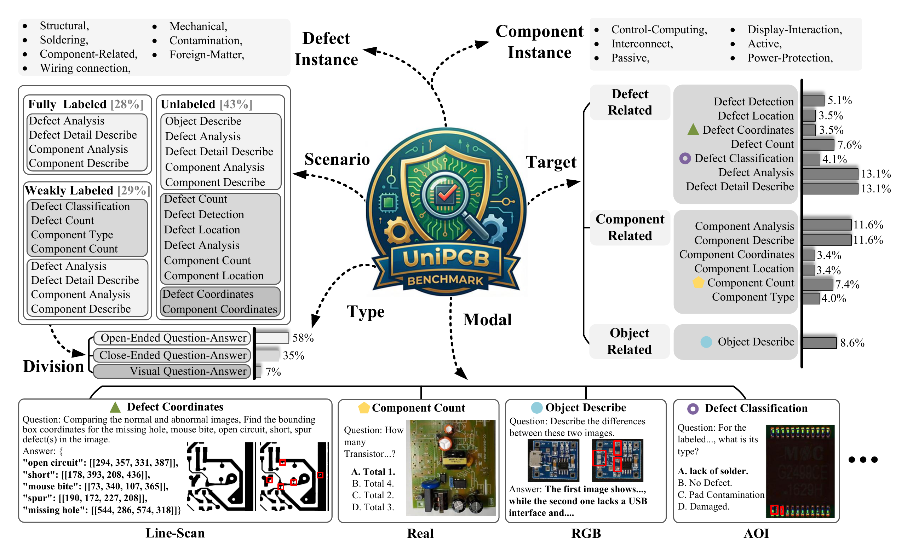
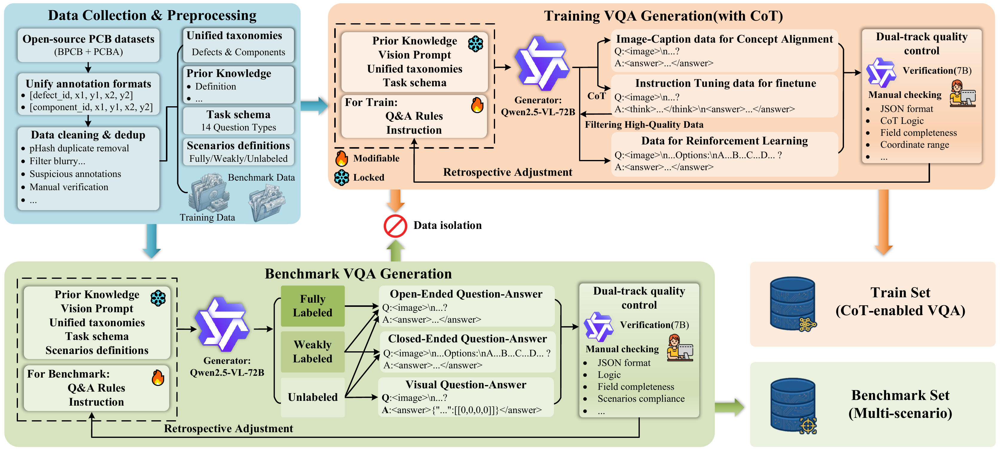

# UniPCB: A Unified Vision-Language Benchmark for PCB Quality Inspection

UniPCB is a unified vision-language benchmark for open-ended printed circuit
board (PCB) quality inspection. It organizes multi-source PCB inspection data
into bilingual, multi-turn visual question answering tasks that require defect
recognition, component understanding, spatial grounding, counting, localization,
and inspection-oriented analysis.

## Highlights

- **PCB-specific VLM benchmark.** UniPCB targets quality inspection tasks that
  require fine-grained recognition, structured localization, and domain-aware
  reasoning over dense circuit-board layouts.
- **Unified inspection schema.** Heterogeneous PCB labels are mapped into a
  consistent taxonomy of defect and component concepts.
- **Three scenario settings.** The benchmark covers fully labeled, weakly
  labeled, and unlabeled settings to test robustness under different annotation
  densities.
- **Fourteen inspection subtasks.** Tasks span object description, defect
  detection, classification, counting, location, coordinates, detail
  description, component understanding, and defect-impact analysis.
- **Reproducible evaluation.** The repository includes OpenAI-compatible
  inference, automatic scoring, and optional LLM-as-judge utilities.

## Overview

<p align="center">
  
</p>

<p align="center">
  
</p>

<p align="center">
  
</p>

## Benchmark Statistics

The current benchmark annotation package contains:

| Item | Count |
| --- | ---: |
| Samples | 5,736 |
| Unique image references | 6,560 |
| QA pairs | 23,308 |
| Languages | English, Chinese |
| Scenario settings | 3 |
| Question types | 14 |

Scenario distribution:

| Scenario | Description | Samples |
| --- | --- | ---: |
| P1 | fully labeled setting with category and bounding-box information | 1,833 |
| P2 | weakly labeled setting with bounding-box information only | 1,898 |
| P3 | unlabeled setting requiring direct recognition and grounding | 2,005 |

Answer format distribution:

| Format | Count |
| --- | ---: |
| Open-ended QA | 13,477 |
| Closed-ended QA | 8,221 |
| Coordinate-grounded VQA | 1,610 |

## Repository Layout

```text
unipcb/
  data/
    benchmark/
      generated/      # benchmark VQA annotations
      raw/            # expected location after downloading image payloads
      results/        # local predictions and evaluation outputs
  docs/
    assets/           # project figures
    release.md        # dataset/model hosting notes
  scripts/
    benchmark_generation/
    dataset/
    evaluation/
    manual_review/
  requirements.txt
```

The GitHub repository should contain code, documentation, project figures, and
generated annotations. Large raw images, local results, model checkpoints, and
temporary archives should remain outside GitHub.

## Data Preparation

The main annotation file is:

```text
data/benchmark/generated/generate_vqa_bilingual_test/all_vqa_data_bilingual_20260426_190307.json
```

A small format-preview subset is included under `examples/`:

```text
examples/
  sample.json
  summary.json
  images/
```

This subset is intended for quick inspection and smoke testing only. It does not
replace the full dataset release.

The raw image payload is referenced through upstream public datasets rather than
stored in this repository. See [`docs/data_sources.md`](docs/data_sources.md)
for source URLs, access terms, expected folders, and per-source usage counts.

Each sample uses repository-relative image paths:

```json
{
  "images": ["data/benchmark/raw/PCBA/bbox_class/40198.jpg"],
  "dataset": "PCBA",
  "dataset_type": "P1",
  "language": "en",
  "conversation": [
    {
      "question": "...",
      "correct_option": "...",
      "type": "defect analysis"
    }
  ]
}
```

After downloading the raw image payload, unpack it so that
`data/benchmark/raw/` contains:

```text
PCBA/
PCB-electric-resistance-Dataset_nodefect/
FPIC/
Dataset-PCB-CNN/
AoI/
DeepPCB/
PCB-Defect-Detection-using-Image-Registration-master/
VisA/
solder-joint-dataset-main/
pcb-component-detection/
```

Validate image paths:

```bash
python scripts/dataset/validate_paths.py
```

Expected output:

```text
records=5736
image_refs=6560
unique_image_refs=6560
missing=0
```

## Installation

```bash
python -m venv .venv
source .venv/bin/activate
pip install -r requirements.txt
```

## Run Inference

The inference script works with an OpenAI-compatible chat completions endpoint,
such as a local vLLM server or a compatible hosted API.

```bash
python scripts/evaluation/run_inference.py \
  --input data/benchmark/generated/generate_vqa_bilingual_test/all_vqa_data_bilingual_20260426_190307.json \
  --output data/benchmark/results/raw_predictions/model_predictions.json \
  --api_base http://localhost:8000/v1 \
  --model PCB-GPT
```

If an API key is required, provide it through an environment variable:

```bash
export UNIPCB_API_KEY=YOUR_API_KEY
```

## Evaluation

```bash
python scripts/evaluation/evaluate.py \
  --input data/benchmark/results/raw_predictions/model_predictions.json \
  --output data/benchmark/results/evaluated/model_evaluation.json
```

The evaluator reports results by dataset, scenario category, question type, and
overall performance. Supported metrics include:

- exact accuracy for closed-ended QA;
- IoU-based matching for coordinate-grounded VQA;
- lightweight text similarity for open-ended QA.

Optional LLM-as-judge scoring:

```bash
python scripts/evaluation/llm_judge.py \
  --input data/benchmark/results/raw_predictions/model_predictions.json \
  --output data/benchmark/results/evaluated/model_llm_judge.json \
  --api_base http://localhost:8000/v1 \
  --model PCB-GPT
```

## PCB-GPT Weights

PCB-GPT weights should be hosted in a separate model repository rather than in
the GitHub code repository. Recommended model repository layout:

```text
PCB-GPT/
  README.md
  config.json
  generation_config.json
  tokenizer files
  model shard files
```

Keep model cards and examples project-scoped. Do not include local paths,
machine names, user names, API keys, training logs with identity metadata, or
links to personal accounts.

## Source Dataset Catalog

UniPCB standardizes samples from the following PCB-related sources:

| Source folder | Role in current benchmark |
| --- | --- |
| `PCBA` | assembled-board defect and component inspection |
| `PCB-electric-resistance-Dataset_nodefect` | resistor/component understanding |
| `FPIC` | weakly labeled PCB inspection |
| `Dataset-PCB-CNN` | defect inspection |
| `AoI` | automated optical inspection samples |
| `DeepPCB` | bare-board defect inspection |
| `PCB-Defect-Detection-using-Image-Registration-master` | image-registration-based defect inspection |
| `VisA` | industrial anomaly inspection subset |
| `solder-joint-dataset-main` | solder-joint inspection |
| `pcb-component-detection` | component detection and grounding |

Source-level licenses and redistribution terms should be documented in the
dataset package and Croissant metadata.

## Release Notes

See [`docs/release.md`](docs/release.md) for the dataset package layout, model
hosting checklist, Croissant metadata notes, and repository cleanup steps.

## License

Add the project license before public release. Dataset redistribution should
respect the licenses and terms of the underlying source datasets.

## Citation

Citation information will be added after release.
